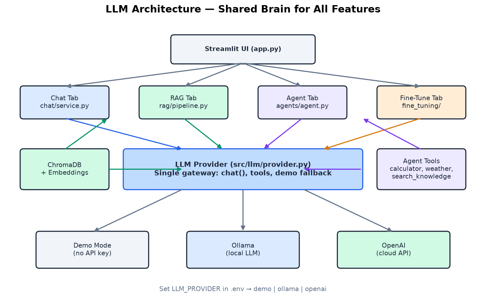
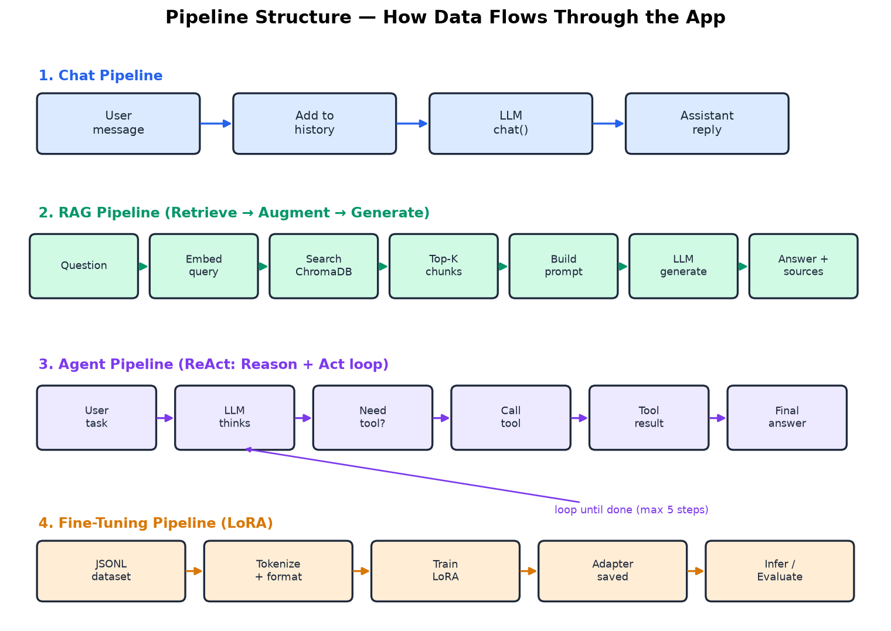
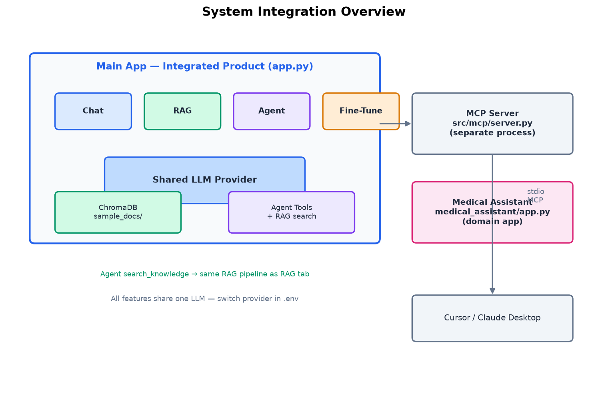
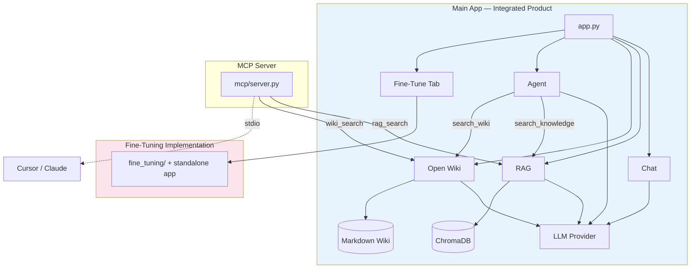
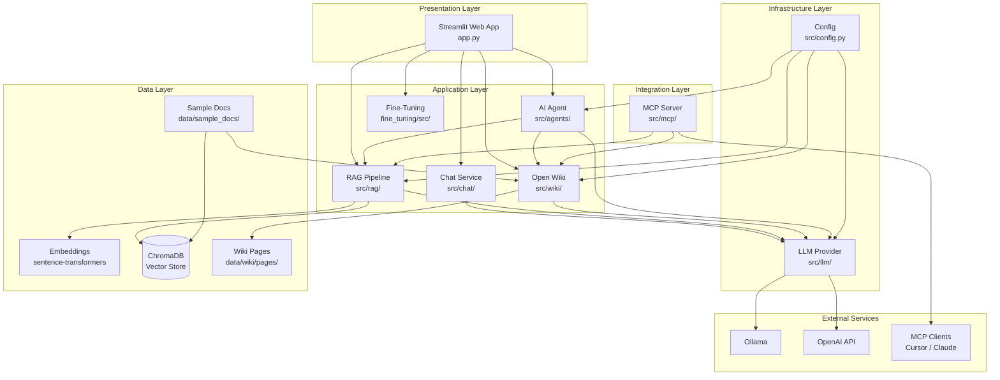

# Architecture Guide

A detailed guide to how the **AI Learning Lab** is designed — layers, components, dependencies, and design decisions.

---

## Table of Contents

1. [Design Goals](#1-design-goals)
2. [Integration Overview](#2-integration-overview)
3. [System Overview](#3-system-overview)
4. [Architecture Layers](#4-architecture-layers)
5. [Component Reference](#5-component-reference)
6. [Module Dependency Map](#6-module-dependency-map)
7. [Data Storage](#7-data-storage)
8. [Configuration Architecture](#8-configuration-architecture)
9. [Technology Stack](#9-technology-stack)
10. [Extension Points](#10-extension-points)
11. [Security Considerations](#11-security-considerations)

---

## 1. Design Goals

This project was designed with these principles:

| Goal | How We Achieve It |
|------|-------------------|
| **Beginner-friendly** | One concept per module, heavy comments, simple Streamlit UI |
| **Runnable without API keys** | Demo mode + local embeddings + optional Ollama |
| **Educational** | Each tab maps to one AI concept with visible internals |
| **Minimal complexity** | No microservices, no Docker required, flat Python structure |
| **Extensible** | Clear interfaces for adding tools, docs, and LLM providers |

---

## 2. Integration Overview

> **Visual diagrams (PNG):** Open [docs/html/index.html](html/index.html) in your browser, or view:
> - [LLM Architecture](images/llm-architecture.png)
> - [Pipeline Structure](images/pipeline-structure.png)
> - [System Integration](images/integration-overview.png)
>
> Regenerate with: `python scripts/generate_diagrams.py`

> **Full diagram:** See [INTEGRATION_DIAGRAM.md](INTEGRATION_DIAGRAM.md) for complete connection maps.

The main app is **one integrated product**. Chat, RAG, Open Wiki, and Agent
share the same LLM provider. RAG uses vector retrieval; Open Wiki uses persistent
markdown pages. MCP exposes both knowledge paths externally.

### LLM Architecture



### Pipeline Structure



### System Integration





### Key Integration Points

| From | To | How |
|------|-----|-----|
| Chat | LLM | `chat/service.py` → `llm.chat()` |
| RAG | LLM + ChromaDB | `rag/pipeline.py` → embed → search → `llm.chat()` |
| Open Wiki | LLM + markdown | `wiki/pipeline.py` → page search → `llm.chat()` |
| Agent | LLM + Tools | `agents/agent.py` → tool loop → `llm.chat()` |
| Agent | RAG | `search_knowledge()` → `rag_query()` |
| Agent | Open Wiki | `search_wiki()` → `wiki_query()` |
| MCP | RAG + Open Wiki + Tools | `rag_search()` and `wiki_search()` delegate to shared pipelines |
| Fine-Tuning | Main app tab + standalone UI | `app.py` and `fine_tuning/app.py` |

---

## 3. System Overview



---

## 4. Architecture Layers

### Layer 1: Presentation (UI)

**File:** `app.py`

Responsibilities:
- Render the Streamlit web interface
- Route user input to the correct service (Chat, RAG, Open Wiki, Agent, Fine-Tune)
- Display responses, retrieved chunks, matched wiki pages, and agent reasoning steps
- Show LLM connection status in the sidebar

**Design choice:** Streamlit was chosen over React/FastAPI because it requires zero frontend code — ideal for students focused on AI concepts, not web development.

---

### Layer 2: Application (Business Logic)

| Module | Path | Responsibility |
|--------|------|----------------|
| Chat Service | `src/chat/service.py` | Manage conversation history, trim context window |
| RAG Pipeline | `src/rag/pipeline.py` | Chunk docs, retrieve context, generate answers |
| Open Wiki Pipeline | `src/wiki/pipeline.py` | Compile documents, search pages, generate answers |
| Wiki Store | `src/wiki/store.py` | Parse, persist, list, and rank markdown pages |
| AI Agent | `src/agents/agent.py` | ReAct loop: reason → act → observe → repeat |
| Agent Tools | `src/agents/tools.py` | Tool definitions and execution |

Each module is independent — you can use Chat without RAG, query Open Wiki
without ChromaDB, or run the Agent without the UI.

---

### Layer 3: Infrastructure

| Module | Path | Responsibility |
|--------|------|----------------|
| LLM Provider | `src/llm/provider.py` | Unified interface for Ollama, OpenAI, Demo |
| Config | `src/config.py` | Load settings from `.env` via pydantic-settings |

The LLM Provider is the **single gateway** to all language model calls. Chat,
RAG, Open Wiki compilation/query, and Agent calls all go through it.

---

### Layer 4: Data

| Component | Path / Tool | Responsibility |
|-----------|-------------|----------------|
| Embeddings | `src/rag/embeddings.py` | Convert text to 384-dim vectors |
| Vector Store | `src/rag/vectorstore.py` | Store and search vectors in ChromaDB |
| Sample Docs | `data/sample_docs/` | Learning content for RAG |
| ChromaDB files | `data/chroma_db/` | Persisted vector index |
| Wiki Pages | `data/wiki/pages/` | Persistent markdown knowledge base |

---

### Layer 5: Integration

| Module | Path | Responsibility |
|--------|------|----------------|
| MCP Server | `src/mcp/server.py` | Expose tools via Model Context Protocol |

Runs as a separate process, communicating over stdio with MCP clients.

---

## 5. Component Reference

### 5.1 LLM Provider

```
┌─────────────────────────────────────────┐
│              LLMProvider                 │
│                                         │
│  chat(messages, tools?, temperature)    │
│       │                                 │
│       ├── demo  → rule-based responses  │
│       ├── ollama → OpenAI-compatible API│
│       └── openai → OpenAI API           │
│                                         │
│  Returns: LLMResponse                   │
│    - content: str                       │
│    - tool_calls: list[ToolCall]         │
│    - finish_reason: str                 │
└─────────────────────────────────────────┘
```

**Key types:**
- `Message` — role + content (system, user, assistant)
- `ToolCall` — tool name + arguments (for agentic AI)
- `LLMResponse` — unified response from any provider

---

### 5.2 Chat Service

```
┌─────────────────────────────────────────┐
│              ChatSession                 │
│                                         │
│  system_prompt: str                     │
│  messages: list[Message]                │
│  max_history: int = 20                  │
│                                         │
│  send(user_message) → assistant reply     │
│  clear() → reset conversation           │
│  get_history_display() → for UI         │
└─────────────────────────────────────────┘
```

**Memory model:** All messages are kept in a list. When history exceeds `max_history`, older non-system messages are trimmed. The system prompt is always preserved.

---

### 5.3 RAG Pipeline

```
INGEST PATH:
  File → chunk_text() → embed_texts() → vector_store.add_documents()

QUERY PATH:
  Question → embed_query() → vector_store.search(top_k)
           → build prompt with context → llm.chat() → answer
```

**Chunking strategy:**
- Chunk size: 500 characters
- Overlap: 50 characters (prevents cutting sentences mid-thought)
- Metadata: source filename, chunk index

---

### 5.4 Open Wiki

```text
COMPILE PATH:
  Source file → compile_file()
              → demo compiler or llm.chat()
              → WikiStore.write_page()
              → Markdown page + refreshed index

QUERY PATH:
  Question → WikiStore.search(top_k)
           → title/tag/body ranking
           → build context from full pages
           → llm.chat() → answer + page references
```

**Core components:**

| Component | Responsibility |
|-----------|----------------|
| `WikiPage` | Parsed slug, title, content, source, and tags |
| `WikiStore` | Filesystem persistence and keyword ranking |
| `compile_file()` | Convert one raw document into a structured page |
| `compile_directory()` | Compile all top-level `.txt` and `.md` sources |
| `wiki_query()` | Search pages, build context, and answer |

**Ranking model:**
- Title-term match: weight 3
- Tag-term match: weight 2
- Body-term match: weight 1

**Key design difference:** RAG stores fragments optimized for semantic machine
retrieval. Open Wiki stores human-readable pages and uses keyword ranking. In
demo mode pages preserve converted source content; with a real LLM they are
generated one page per source. Querying requires no embeddings or vector database.

This implementation does not perform the cross-page synthesis, entity
maintenance, or contradiction detection found in more complete LLM Wiki systems.

---

### 5.5 AI Agent

```
┌─────────────────────────────────────────┐
│                 Agent                    │
│                                         │
│  max_steps: int = 5                     │
│                                         │
│  run(user_query) → AgentResult          │
│    - answer: str                        │
│    - steps: list[AgentStep]             │
│    - total_steps: int                   │
└─────────────────────────────────────────┘
```

**ReAct pattern:** The agent loops up to `max_steps` times. Each iteration:
1. Send messages + tool schemas to LLM
2. If LLM returns tool calls → execute tools → add results to messages
3. If LLM returns text → return as final answer

---

### 5.6 MCP Server

```
┌─────────────────────────────────────────┐
│         MCPServer("ai-learning-lab")     │
│                                         │
│  Transport: stdio (JSON-RPC)            │
│                                         │
│  Tools:                                 │
│    @server.tool() calc(expression)      │
│    @server.tool() weather(city)         │
│    @server.tool() current_time()        │
│    @server.tool() rag_search(query)     │
│    @server.tool() wiki_search(query)    │
└─────────────────────────────────────────┘
```

Runs independently from the Streamlit app. External clients (Cursor, Claude Desktop) spawn this process and communicate via stdin/stdout.

---

## 6. Module Dependency Map

```
app.py
│
├── src/config.py                    (settings singleton)
│
├── src/llm/provider.py              (llm singleton)
│   └── openai, httpx
│
├── src/chat/service.py
│   └── src/llm/provider.py
│
├── src/rag/
│   ├── embeddings.py
│   │   └── sentence-transformers
│   ├── vectorstore.py
│   │   ├── chromadb
│   │   └── embeddings.py
│   └── pipeline.py
│       ├── vectorstore.py
│       └── llm/provider.py
│
├── src/wiki/
│   ├── store.py
│   │   ├── config.py
│   │   └── data/wiki/pages/*.md
│   └── pipeline.py
│       ├── store.py
│       └── llm/provider.py
│
├── src/agents/
│   ├── tools.py
│   │   ├── rag/pipeline.py (search_knowledge tool)
│   │   └── wiki/pipeline.py (search_wiki tool)
│   └── agent.py
│       ├── tools.py
│       └── llm/provider.py
│
└── src/mcp/server.py
    ├── agents/tools.py
    ├── rag/pipeline.py
    └── wiki/pipeline.py
```

**Rule:** All paths to the LLM go through `src/llm/provider.py`. No module calls Ollama or OpenAI directly.

---

## 7. Data Storage

| Data | Location | Persisted? | Format |
|------|----------|------------|--------|
| Vector embeddings | `data/chroma_db/` | Yes | ChromaDB binary |
| Sample documents | `data/sample_docs/` | Yes | `.txt`, `.md` files |
| Open Wiki pages | `data/wiki/pages/` | Yes | Markdown + frontmatter |
| Chat history | In-memory (Streamlit session) | No | Python list |
| Agent steps | In-memory (per request) | No | Python dataclass |
| Configuration | `.env` | Yes | Key-value pairs |

### ChromaDB Collection

- **Collection name:** `learning_docs`
- **Distance metric:** Cosine similarity
- **Embedding dimensions:** 384 (from `all-MiniLM-L6-v2`)

---

## 8. Configuration Architecture

```
.env file
    │
    ▼
pydantic-settings (src/config.py)
    │
    ├── settings.llm_provider
    ├── settings.ollama_base_url
    ├── settings.openai_api_key
    ├── settings.embedding_model
    ├── settings.chroma_persist_dir
    ├── settings.wiki_pages_dir
    └── settings.wiki_raw_dir
         │
         ▼
    Used by all modules at import time
```

**Singleton pattern:** `settings`, `llm`, `vector_store`, and `wiki_store` are
module-level singletons imported wherever needed.

---

## 9. Technology Stack

| Layer | Technology | Version | Purpose |
|-------|-----------|---------|---------|
| Language | Python | 3.10+ | Core runtime |
| UI | Streamlit | 1.32+ | Web interface |
| LLM (local) | Ollama | Latest | Free local inference |
| LLM (cloud) | OpenAI API | 1.30+ | Cloud inference |
| Embeddings | sentence-transformers | 3.0+ | Local text → vectors |
| Vector DB | ChromaDB | 0.5+ | Similarity search |
| MCP | mcp SDK | 1.0+ | Tool protocol server |
| Config | pydantic-settings | 2.3+ | Type-safe .env loading |
| HTTP | httpx | 0.27+ | Ollama health checks |

### Why These Choices?

- **No Docker/Kubernetes** — students can `pip install` and run immediately
- **No separate database server** — ChromaDB embeds in-process
- **No frontend framework** — Streamlit handles UI in pure Python
- **Ollama first** — free, private, no API key management for learning

---

## 10. Extension Points

### Add a New LLM Provider

1. Add settings in `src/config.py`
2. Add a branch in `LLMProvider.chat()` in `src/llm/provider.py`
3. Update `.env.example`

### Add a New Agent Tool

1. Write the function in `src/agents/tools.py`
2. Register in `TOOLS` dict
3. Add schema to `TOOL_SCHEMAS` list
4. (Optional) Expose via MCP in `src/mcp/server.py`

### Add New Documents for RAG

1. Place `.txt` or `.md` files in `data/sample_docs/`
2. Run `python scripts/ingest.py`
3. Query via RAG tab or agent's `search_knowledge` tool

### Add or Compile Open Wiki Knowledge

1. Place `.txt` or `.md` files in `data/sample_docs/`
2. Run `python scripts/compile_wiki.py`, or click **Compile Sample Docs**
3. Review generated pages in `data/wiki/pages/`
4. Query through the Open Wiki tab, Agent `search_wiki`, direct
   `wiki_query()`, or MCP `wiki_search`

For a custom source directory, call
`compile_directory(Path("your/source/path"))` from Python.

### Add a New UI Tab

1. Add a tab in `app.py` using `st.tabs()`
2. Import the relevant service module
3. Wire user input to the service and display results

---

## 11. Security Considerations

| Area | Current Behavior | Production Recommendation |
|------|-----------------|--------------------------|
| Calculator tool | Parses an allowlisted Python AST | Add expression-size and execution-cost limits |
| API keys | Stored in `.env` (gitignored) | Use secret manager |
| MCP server | stdio, no auth | Add auth for remote deployment |
| Wiki writes | Source-derived filenames | Validate allowed source paths and generated slugs |
| Wiki content | Included in LLM prompts | Treat imported pages as untrusted; defend against prompt injection |
| Wiki consistency | Pages may duplicate or conflict | Add canonical slugs, provenance, review, and conflict detection |
| Weather tool | Mock data | Connect to real API with rate limits |
| Agent steps | Capped at 5 | Configure per use case |
| User input | Passed directly to LLM | Add input sanitization |

This is a **learning project** — security is simplified intentionally. Do not deploy as-is to production.

---

## Related Documentation

- [Demo Accuracy Guide](DEMO_PROJECT_GUIDE.md) — exact behavior and educational limitations
- [How to Run and Use](RUN_AND_USE.md) — install, run, and use every feature
- [User Guide](USER_GUIDE.md) — how to use the application
- [Call Flow Guide](CALL_FLOW_GUIDE.md) — step-by-step request flows
- [Concepts Guide](CONCEPTS.md) — AI concept explanations
- [Advanced Concepts & Expert Roadmap](ADVANCED_CONCEPTS.md) — topics not covered but needed for experts
