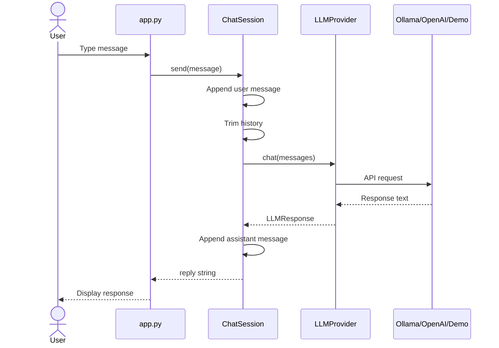
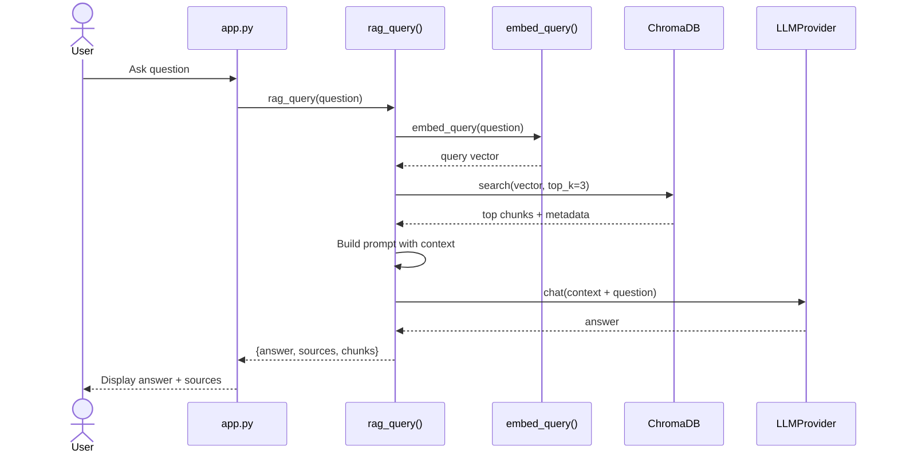
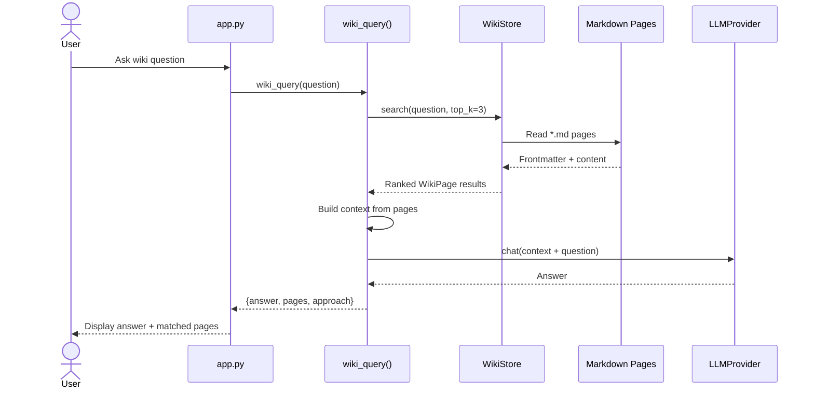
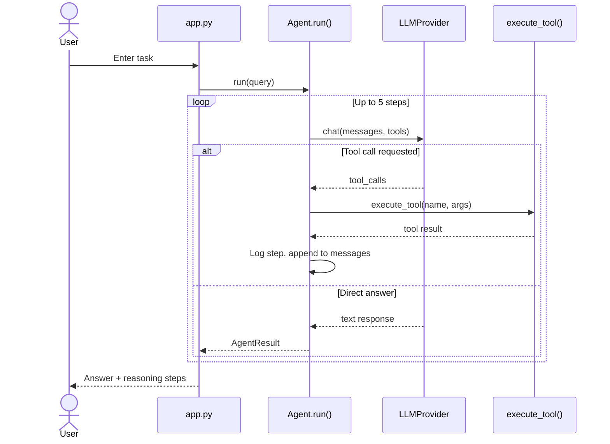
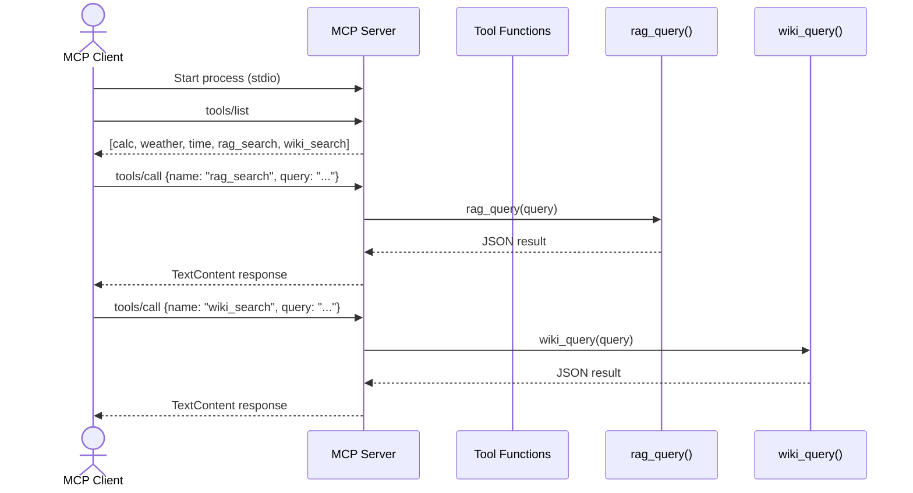

# Call Flow Guide

Step-by-step flows for every major operation in the **AI Learning Lab** — what happens from user action to final response.

---

## Table of Contents

1. [Overview](#1-overview)
2. [Application Startup Flow](#2-application-startup-flow)
3. [Chat Call Flow](#3-chat-call-flow)
4. [RAG Ingest Flow](#4-rag-ingest-flow)
5. [RAG Query Flow](#5-rag-query-flow)
   - [Open Wiki Compile Flow](#open-wiki-compile-flow)
   - [Open Wiki Query Flow](#open-wiki-query-flow)
6. [Agent Call Flow](#6-agent-call-flow)
7. [MCP Tool Call Flow](#7-mcp-tool-call-flow)
8. [LLM Provider Routing Flow](#8-llm-provider-routing-flow)
9. [Sequence Diagrams](#9-sequence-diagrams)
10. [Error Handling Flows](#10-error-handling-flows)

---

## 1. Overview

Every feature in this project follows the same high-level pattern:

```
User Action → UI (app.py) → Service Module → LLM Provider → Response → UI Display
```

Some flows add extra steps (embedding, vector search, tool execution) between the service and the LLM.

---

## 2. Application Startup Flow

```
1. User runs: python -m streamlit run app.py
        │
2. Streamlit loads app.py
        │
3. app.py adds project root to sys.path
        │
4. Imports trigger module initialization:
        │
        ├── src/config.py
        │     └── Reads .env → creates settings singleton
        │
        ├── src/llm/provider.py
        │     └── Creates llm singleton (reads settings.llm_provider)
        │
        ├── src/rag/vectorstore.py
        │     └── Creates vector_store singleton
        │           └── Opens/creates ChromaDB at data/chroma_db/
        │
        └── src/wiki/store.py
              └── Creates wiki_store singleton
                    └── Reads markdown pages from data/wiki/pages/
        │
5. Streamlit renders page:
        │
        ├── Sidebar: llm.check_connection() → show status
        ├── Sidebar: vector_store.document_count → show chunk count
        ├── Sidebar: wiki_store.page_count → show page count
        └── Main area: 6 tabs
            (Chat, RAG, Open Wiki, Agent, Fine-Tune, Concepts)
        │
6. Browser opens at http://localhost:8501
```

---

## 3. Chat Call Flow

### Trigger
User types a message in the Chat tab and presses Enter.

### Step-by-Step

```
STEP 1: UI receives input
  File: app.py
  Action: st.chat_input("Ask me anything...") returns user text

STEP 2: Display user message
  File: app.py
  Action: st.chat_message("user").write(prompt)

STEP 3: Send to chat service
  File: src/chat/service.py → ChatSession.send()
  Action:
    a. Append Message(role="user", content=prompt) to messages list
    b. Trim history if > max_history (20 messages)

STEP 4: Call LLM
  File: src/llm/provider.py → LLMProvider.chat()
  Action:
    a. Check provider (demo / ollama / openai)
    b. Convert messages to API format
    c. Send to LLM (or return demo response)
    d. Return LLMResponse with content

STEP 5: Store assistant reply
  File: src/chat/service.py
  Action:
    a. Append Message(role="assistant", content=reply) to messages
    b. Return reply string

STEP 6: Display response
  File: app.py
  Action: st.chat_message("assistant").write(reply)
```

### Message List Evolution

```
Turn 1:
  [system: "You are a helpful AI tutor..."]
  [user: "Hello"]
  [assistant: "Hi! How can I help?"]

Turn 2:
  [system: "You are a helpful AI tutor..."]
  [user: "Hello"]
  [assistant: "Hi! How can I help?"]
  [user: "What is RAG?"]
  [assistant: "RAG stands for..."]
```

### Files Involved

| Step | File | Function |
|------|------|----------|
| 1–2, 6 | `app.py` | Streamlit UI |
| 3, 5 | `src/chat/service.py` | `ChatSession.send()` |
| 4 | `src/llm/provider.py` | `LLMProvider.chat()` |

---

## 4. RAG Ingest Flow

### Trigger
User clicks **"Ingest Sample Docs"** in RAG tab, or runs `python scripts/ingest.py`.

### Step-by-Step

```
STEP 1: Find documents
  File: src/rag/pipeline.py → ingest_directory()
  Action: Glob data/sample_docs/*.txt and *.md

STEP 2: For each file → ingest_file()
  File: src/rag/pipeline.py
  Action:
    a. Read file text (UTF-8)
    b. chunk_text(text, chunk_size=500, overlap=50)
       → ["chunk1...", "chunk2...", ...]

STEP 3: Create embeddings
  File: src/rag/embeddings.py → embed_texts()
  Action:
    a. Load sentence-transformers model (cached after first call)
    b. Encode all chunks → list of 384-dim vectors

STEP 4: Store in vector database
  File: src/rag/vectorstore.py → add_documents()
  Action:
    a. Generate IDs: "01_generative_ai_0", "01_generative_ai_1", ...
    b. Attach metadata: {source: filename, chunk_index: N}
    c. ChromaDB collection.add(documents, embeddings, metadatas, ids)

STEP 5: Return results
  Action: {"01_generative_ai.txt": 3, "02_rag.txt": 4, ...}
```

### Data Transformation

```
"Generative AI is..."  (full document, ~1200 chars)
        │
        ▼ chunk_text()
["Generative AI is...500chars", "...overlap+next500...", "...last chunk"]
        │
        ▼ embed_texts()
[[0.12, -0.45, ...384 nums], [0.08, 0.33, ...], [...]]
        │
        ▼ ChromaDB
Stored with metadata {source: "01_generative_ai.txt", chunk_index: 0}
```

---

## 5. RAG Query Flow

### Trigger
User types a question and clicks **"Search & Answer"** in the RAG tab.

### Step-by-Step

```
STEP 1: UI sends question
  File: app.py
  Action: rag_query(rag_question, top_k=3)

STEP 2: Embed the query
  File: src/rag/embeddings.py → embed_query()
  Action: "What is RAG?" → [0.15, -0.38, ...] (384-dim vector)

STEP 3: Search vector database
  File: src/rag/vectorstore.py → search()
  Action:
    a. ChromaDB query with query embedding
    b. Cosine similarity → top 3 closest chunks
    c. Return [{text, metadata, distance, relevance}, ...]

STEP 4: Check for empty results
  File: src/rag/pipeline.py
  Action: If no chunks → return "No documents indexed yet"

STEP 5: Build augmented prompt
  File: src/rag/pipeline.py
  Action:
    a. Format chunks with source labels
    b. Insert into RAG_SYSTEM_PROMPT template
    c. Create messages: [system with context, user question]

STEP 6: Generate answer
  File: src/llm/provider.py → chat()
  Action: LLM generates answer grounded in retrieved context

STEP 7: Demo mode fallback (if applicable)
  File: src/rag/pipeline.py
  Action: If demo mode → show retrieved chunks instead of LLM answer

STEP 8: Return and display
  File: app.py
  Action: Show answer, sources, and expandable chunk details
```

### Prompt Structure Sent to LLM

```
SYSTEM:
  You are a helpful assistant that answers questions based on the provided context.
  Use ONLY the context below to answer...

  Context:
  [1] (from 02_rag.txt)
  RAG is a technique that combines information retrieval...

  [2] (from 04_embeddings.txt)
  A vector database stores embeddings...

USER:
  What is RAG?
```

---

### Open Wiki Compile Flow

### Trigger
The user clicks **Compile Sample Docs** in the Open Wiki tab or runs
`python scripts/compile_wiki.py`.

### Step-by-Step

```text
STEP 1: Select source directory
  UI: app.py → compile_sample_docs()
  CLI: scripts/compile_wiki.py → compile_sample_docs()
  Source: settings.sample_docs_dir (data/sample_docs/)

STEP 2: Discover source files
  File: src/wiki/pipeline.py → compile_directory()
  Action: Find all top-level *.txt and *.md files

STEP 3: Compile each file
  File: src/wiki/pipeline.py → compile_file()
  Action:
    a. Read source as UTF-8
    b. Create a stable page slug and title
    c. If demo mode:
         _demo_compile_page() creates summary/key-point markdown
       Otherwise:
         llm.chat(COMPILE_SYSTEM_PROMPT + source text)

STEP 4: Persist page
  File: src/wiki/store.py → WikiStore.write_page()
  Action:
    a. Add frontmatter (title, source, tags)
    b. Write page under data/wiki/pages/concepts/

STEP 5: Refresh index
  File: src/wiki/pipeline.py → _ensure_index()
  Action: Rebuild data/wiki/pages/index.md with links to all pages

STEP 6: Return result
  Shape: {"01_generative_ai.txt": "concepts/01-generative-ai", ...}
  UI displays success; CLI prints source-to-page mappings
```

### Data Transformation

```text
Raw document
  → title/slug generation
  → LLM page generation or deterministic demo conversion
  → YAML-like frontmatter + markdown body + [[wikilinks]]
  → persistent, human-readable wiki page
```

Unlike RAG ingest, this flow does not create embeddings or write to ChromaDB.

---

### Open Wiki Query Flow

### Trigger
The user clicks **Query Wiki**, calls `wiki_query()` directly, asks the Agent to
search the wiki, or invokes the MCP `wiki_search` tool.

### Step-by-Step

```text
STEP 1: Receive question
  Direct UI: app.py → wiki_query(question)
  Agent: search_wiki(query) → wiki_query(query, top_k=2)
  MCP: wiki_search(query) → wiki_query(query)

STEP 2: Search pages
  File: src/wiki/pipeline.py → wiki_search()
  File: src/wiki/store.py → WikiStore.search()
  Action:
    a. Tokenize query terms
    b. Read markdown pages and frontmatter
    c. Score title hits × 3, tag hits × 2, body hits × 1
    d. Return top-k WikiPage objects

STEP 3: Handle no matches
  Return instructions to compile pages; no LLM call is made

STEP 4: Build wiki context
  Format each matched page with title, slug, and synthesized content

STEP 5: Generate answer
  File: src/llm/provider.py → llm.chat()
  Prompt rule: answer only from matched wiki pages and cite page names

STEP 6: Demo fallback
  If LLM_PROVIDER=demo, display matched pages and previews directly

STEP 7: Return result
  {
    "answer": "...",
    "pages": [{slug, title, score, source, preview}, ...],
    "approach": "open_wiki"
  }
```

### RAG Query vs Open Wiki Query

| Stage | RAG | Open Wiki |
|-------|-----|-----------|
| Search input | Query embedding | Query words |
| Search target | ChromaDB chunks | Markdown pages |
| Ranking | Vector similarity | Title/tag/body overlap |
| Context | Raw retrieved fragments | Precompiled page synthesis |
| Sources returned | Documents/chunks | Wiki pages |

---

## 6. Agent Call Flow

### Trigger
User types a task and clicks **"Run Agent"** in the Agent tab.

### Step-by-Step

```
STEP 1: UI sends query
  File: app.py
  Action: Agent().run(agent_query)

STEP 2: Initialize agent
  File: src/agents/agent.py
  Action:
    a. Create messages: [system prompt, user query]
    b. steps = [] (empty reasoning log)

STEP 3: Agent loop (up to max_steps = 5)
  ┌─────────────────────────────────────────────┐
  │  FOR step_num in 1..5:                      │
  │                                             │
  │  3a. Call LLM with tools                    │
  │      llm.chat(messages, tools=TOOL_SCHEMAS) │
  │                                             │
  │  3b. IF response has tool_calls:            │
  │      FOR each tool_call:                    │
  │        - execute_tool(name, arguments)      │
  │        - Log AgentStep (tool, input, output)│
  │        - Append assistant + tool result     │
  │          messages for next iteration        │
  │      CONTINUE loop                          │
  │                                             │
  │  3c. ELSE (text response):                  │
  │      - Log AgentStep (direct answer)        │
  │      - RETURN AgentResult(answer, steps)    │
  └─────────────────────────────────────────────┘

STEP 4: Max steps reached
  Action: Return "Reached maximum steps..."

STEP 5: Display results
  File: app.py
  Action: Show final answer + expandable reasoning steps
```

### Example: "What is 25 * 17?"

```
Step 1:
  LLM receives: "What is 25 * 17?" + tool schemas
  LLM returns: tool_call → calculator({expression: "25 * 17"})
  execute_tool → "425"
  messages now include tool result

Step 2:
  LLM receives: "...Tool result (calculator): 425. Now provide your final answer."
  LLM returns: "25 × 17 = 425"
  No tool calls → return AgentResult
```

### Example: Multi-Tool Query

```
Query: "What's 15*23 and the weather in Tokyo?"

Step 1: tool_call → calculator("15*23") → "345"
Step 2: tool_call → get_weather("Tokyo") → "28°C, Humid"
Step 3: LLM → "15×23 = 345. Tokyo is 28°C and humid."
```

### Example: Wiki Tool Query

```text
Query: "Search the wiki: what is Open Wiki?"

Step 1: LLM selects search_wiki({query: "what is Open Wiki?"})
Step 2: execute_tool() calls wiki_query(query, top_k=2)
Step 3: Wiki store ranks and reads matching markdown pages
Step 4: Tool result is returned to the agent
Step 5: LLM produces the final response
```

### Tool Execution Detail

```
execute_tool("calculator", {"expression": "25 * 17"})
    │
    ▼
TOOLS["calculator"] → calculator("25 * 17")
    │
    ▼
parse Python AST and evaluate allowlisted nodes/functions → "425"
```

---

## 7. MCP Tool Call Flow

### Trigger
An external MCP client (e.g., Cursor) connects and calls a tool.

### Step-by-Step

```
STEP 1: Client starts server process
  Command: python -m src.mcp.server
  Transport: stdio (stdin/stdout JSON-RPC)

STEP 2: Client sends initialize handshake
  Protocol: MCP JSON-RPC over stdio

STEP 3: Client requests tool list
  Request: tools/list
  Server: Returns [calc, weather, current_time, rag_search, wiki_search]

STEP 4: Client calls a tool
  Request: tools/call {name: "calc", arguments: {expression: "2+2}}
        │
        ▼
  File: src/mcp/server.py
  Action: calc("2+2") → calculator("2+2") → "4"
        │
        ▼
  Response: TextContent(type="text", text="4")

STEP 5: Client displays result
```

### MCP Knowledge Calls

```text
rag_search(query)
  → src/mcp/server.py
  → rag_query(query)
  → embeddings + ChromaDB + LLM
  → JSON {answer, sources, chunks}

wiki_search(query)
  → src/mcp/server.py
  → wiki_query(query)
  → markdown page search + LLM
  → JSON {answer, pages, approach}
```

### MCP vs Agent Tool Flow

| Aspect | Agent (in-app) | MCP (external) |
|--------|---------------|----------------|
| Who decides to call tool | LLM (autonomous) | External client |
| Transport | Python function call | stdio JSON-RPC |
| Tool registry | `TOOL_SCHEMAS` in tools.py | `@server.tool()` in server.py |
| RAG entry | `search_knowledge` | `rag_search` |
| Wiki entry | `search_wiki` | `wiki_search` |
| Shared logic | Both delegate to the same RAG and Wiki pipelines |

---

## 8. LLM Provider Routing Flow

Every LLM call passes through this decision tree:

```
LLMProvider.chat(messages, tools?, temperature)
        │
        ▼
  provider == "demo"?
    │
    ├── YES → _demo_response()
    │         ├── Has tools + math keywords? → return calculator tool_call
    │         ├── Has tools + "weather"? → return weather tool_call
    │         ├── "rag"/"document" in message? → RAG explanation
    │         └── Default → setup instructions message
    │
    └── NO → _get_openai_client()
              │
              ├── provider == "ollama"
              │     └── OpenAI client → base_url=ollama/v1, api_key="ollama"
              │
              └── provider == "openai"
                    └── OpenAI client → api_key from .env
              │
              ▼
        client.chat.completions.create(model, messages, tools?)
              │
              ▼
        Parse response → LLMResponse(content, tool_calls, finish_reason)
```

---

## 9. Sequence Diagrams

### Chat Sequence



### RAG Query Sequence



### Open Wiki Query Sequence



### Agent Sequence



### MCP Sequence



---

## 10. Error Handling Flows

### LLM Connection Failure

```
llm.check_connection()
    │
    ├── ollama: GET /api/tags
    │     ├── Success → {status: "ok", models: [...]}
    │     └── Failure → {status: "error", message: "..."}
    │
    ├── openai: check API key set
    │     ├── Key valid format → {status: "ok"}
    │     └── Missing → {status: "error"}
    │
    └── demo → {status: "ok", provider: "demo"}

UI sidebar shows warning if status != "ok"
```

### Empty Vector Store

```
rag_query(question)
    │
    ▼
vector_store.search() → []
    │
    ▼
Return: "No documents indexed yet. Run ingest script..."
(No LLM call made)
```

### Empty Open Wiki

```text
wiki_query(question)
    │
    ▼
WikiStore.search() → []
    │
    ▼
Return: "No wiki pages found. Click 'Compile Sample Docs'..."
(No LLM call made)
```

### Agent Max Steps

```
Agent loop reaches step 5 without final answer
    │
    ▼
Return: "Reached maximum steps. Please try a simpler question."
(steps list shows all attempted tool calls)
```

### Tool Execution Error

```
calculator("invalid expression")
    │
    ▼
AST parsing/evaluation raises an allowed exception
    │
    ▼
Return: "Error: <exception message>"
(Agent continues with error as tool output)
```

---

## Quick Reference: Which File Handles What?

| User Action | Entry Point | Core Logic | LLM Call? |
|-------------|-------------|------------|-----------|
| Send chat message | `app.py` | `chat/service.py` | Yes |
| Ingest documents | `app.py` / `scripts/ingest.py` | `rag/pipeline.py` | No |
| RAG question | `app.py` | `rag/pipeline.py` | Yes |
| Compile wiki | `app.py` / `scripts/compile_wiki.py` | `wiki/pipeline.py`, `wiki/store.py` | Yes, except demo mode |
| Wiki question | `app.py` | `wiki/pipeline.py`, `wiki/store.py` | Yes, except demo display |
| Run agent | `app.py` | `agents/agent.py` | Yes (per step) |
| Agent RAG search | `search_knowledge` | `rag/pipeline.py` | Yes |
| Agent Wiki search | `search_wiki` | `wiki/pipeline.py` | Yes, except demo display |
| MCP tool call | External client | `mcp/server.py` | For `rag_search` and `wiki_search` |
| Check LLM status | `app.py` sidebar | `llm/provider.py` | No |

---

## Related Documentation

- [How to Run and Use](RUN_AND_USE.md) — install, run, and use every feature
- [Integration Diagram](INTEGRATION_DIAGRAM.md) — how Chat, RAG, Agent & MCP connect
- [User Guide](USER_GUIDE.md) — how to use each feature
- [Architecture Guide](ARCHITECTURE_GUIDE.md) — system design and components
- [Concepts Guide](CONCEPTS.md) — AI concept explanations
