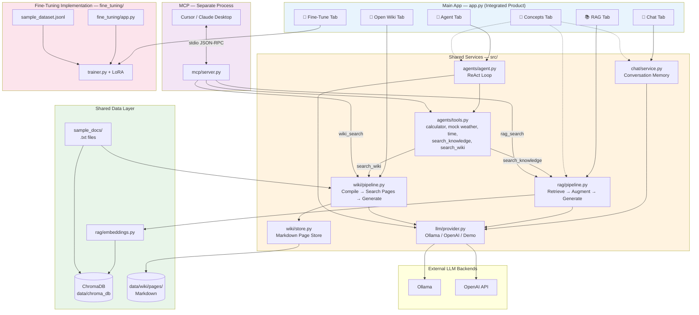
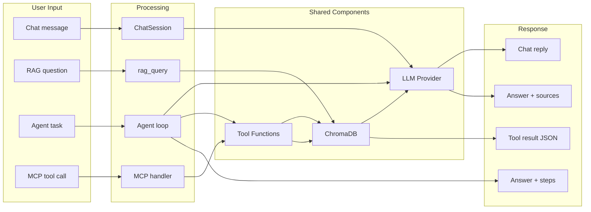

# Integration Diagram — How Everything Connects

This document shows how **Chat**, **RAG**, **Open Wiki**, **Agents**, **MCP**,
**Fine-Tuning**, and the **Medical Assistant** work together.

> **Current implementation note:** The main app has six top-level tabs: Chat,
> RAG, Open Wiki, Agent, Fine-Tune, and Concepts. Some large ASCII diagrams below
> emphasize the original RAG path to keep them readable. Open Wiki is a parallel
> path: `app.py → wiki/pipeline.py → wiki/store.py → data/wiki/pages/`, and is
> available to the Agent as `search_wiki` and to MCP as `wiki_search`.

> **PNG diagrams:** [LLM Architecture](images/llm-architecture.png) · [Pipeline Structure](images/pipeline-structure.png) · [System Integration](images/integration-overview.png)  
> Regenerate: `python scripts/generate_diagrams.py`

---

## 0. Repository Overview — Three Applications

| App | Folder | Type | Domain |
|-----|--------|------|--------|
| **AI Learning Lab** | `/` (root `app.py`) | Integrated product | General AI education |
| **Medical Assistant** | `medical_assistant/` | Integrated product | Healthcare education |
| **Fine-Tuning Lab** | `fine_tuning/` | In main app Fine-Tune tab + standalone |

```
AI_APP/
├── app.py                    ← Main lab (Chat, RAG, Wiki, Agent, Fine-Tune)
├── medical_assistant/app.py  ← Healthcare lab (same architecture)
└── fine_tuning/app.py        ← LoRA training (standalone)
```

See [medical_assistant/docs/INTEGRATION_DIAGRAM.md](../medical_assistant/docs/INTEGRATION_DIAGRAM.md) for medical app details.

---

## 1. Big Picture — One Product, Two Modules

```
┌─────────────────────────────────────────────────────────────────────────────┐
│                         AI LEARNING LAB (AI_APP)                            │
│                                                                             │
│  ┌───────────────────────────────────────────────────────────────────────┐  │
│  │              MAIN INTEGRATED PRODUCT  (app.py)                        │  │
│  │                                                                       │  │
│  │   ┌─────────┐   ┌─────────┐   ┌─────────┐   ┌──────────┐           │  │
│  │   │  CHAT   │   │   RAG   │   │  AGENT  │   │ CONCEPTS │           │  │
│  │   │  Tab    │   │  Tab    │   │  Tab    │   │   Tab    │           │  │
│  │   └────┬────┘   └────┬────┘   └────┬────┘   └──────────┘           │  │
│  │        │             │             │                                  │  │
│  │        ▼             ▼             ▼                                  │  │
│  │   chat/service   rag/pipeline   agents/agent                         │  │
│  │        │             │             │                                  │  │
│  │        │             │        agents/tools ◄── search_knowledge ──┐ │  │
│  │        │             │             │                               │ │  │
│  │        └─────────────┼─────────────┘                               │ │  │
│  │                      │                                             │ │  │
│  │                      ▼                                             │ │  │
│  │              ┌───────────────┐                                     │ │  │
│  │              │  LLM Provider │ ◄── shared by Chat, RAG, Agent     │ │  │
│  │              │  (src/llm/)   │                                     │ │  │
│  │              └───────┬───────┘                                     │ │  │
│  │                      │                                             │ │  │
│  │         ┌────────────┼────────────┐                                │ │  │
│  │         ▼            ▼            ▼                                │ │  │
│  │    Ollama API   OpenAI API   Demo Mode                            │ │  │
│  │                                                                     │ │  │
│  │   RAG DATA LAYER (shared by RAG tab + Agent + MCP):                │ │  │
│  │   ┌────────────┐    ┌────────────┐    ┌──────────────┐            │ │  │
│  │   │ Embeddings │───►│  ChromaDB  │◄───│ Sample Docs  │            │ │  │
│  │   │ (vectors)  │    │ (vectors)  │    │ data/sample/ │            │ │  │
│  │   └────────────┘    └─────┬──────┘    └──────────────┘            │ │  │
│  │                           │                                        │ │  │
│  │                           └────────────────────────────────────────┘ │  │
│  │                                                                       │  │
│  │   MCP SERVER (separate process, same codebase):                      │  │
│  │   ┌─────────────────────────────────────────────────────────────┐   │  │
│  │   │  src/mcp/server.py  ◄── stdio ──►  Cursor / Claude Desktop   │   │  │
│  │   │  Tools: calc, weather, time, rag_search ──► rag/pipeline    │   │  │
│  │   └─────────────────────────────────────────────────────────────┘   │  │
│  └───────────────────────────────────────────────────────────────────────┘  │
│                                                                             │
│  ┌───────────────────────────────────────────────────────────────────────┐  │
│  │         INTEGRATED + STANDALONE MODULE  (fine_tuning/)                 │  │
│  │         Used by main Fine-Tune tab and fine_tuning/app.py             │  │
│  │                                                                       │  │
│  │   fine_tuning/app.py ──► trainer.py ──► LoRA adapter ──► inference   │  │
│  │                              │                                        │  │
│  │                         sample_dataset.jsonl                          │  │
│  └───────────────────────────────────────────────────────────────────────┘  │
└─────────────────────────────────────────────────────────────────────────────┘
```

---

## 2. Mermaid — Full Integration Map



---

## 3. How Features Connect (Integration Points)

### 3.1 Shared LLM Provider

**All three main features use the same brain:**

```
                    ┌─────────────────────┐
                    │   llm/provider.py   │
                    │   (single instance) │
                    └──────────┬──────────┘
                               │
           ┌───────────────────┼───────────────────┐
           │                   │                   │
           ▼                   ▼                   ▼
    chat/service.py      rag/pipeline.py     agents/agent.py
    (conversation)       (grounded answers)  (tool decisions)
```

| Feature | Calls LLM? | Purpose |
|---------|-----------|---------|
| Chat | Yes | Generate conversational replies |
| RAG | Yes | Generate answer from retrieved context |
| Agent | Yes (per step) | Decide tools + synthesize final answer |

---

### 3.2 RAG Shared by Three Entry Points

**One RAG pipeline, three ways to use it:**

```
                         rag/pipeline.py
                         (rag_query function)
                               │
         ┌─────────────────────┼─────────────────────┐
         │                     │                     │
         ▼                     ▼                     ▼
   RAG Tab (UI)      Agent search_knowledge    MCP rag_search
   app.py            agents/tools.py           mcp/server.py
         │                     │                     │
   User clicks          Agent decides to          External AI
   "Search & Answer"    search docs               client calls tool
```

**Flow when Agent searches docs:**
```
User: "Search the docs: what is RAG?"
  → Agent.run()
  → LLM decides: call search_knowledge
  → tools.search_knowledge("what is RAG?")
  → rag_query("what is RAG?")        ← same function as RAG tab!
  → vector_store.search()
  → llm.chat(context + question)
  → result returned to agent
  → agent gives final answer
```

---

### 3.3 Agent Tools = MCP Tools (Shared Logic)

```
agents/tools.py                    mcp/server.py
┌──────────────────┐              ┌──────────────────┐
│ calculator()     │◄────────────►│ calc()           │
│ get_weather()    │◄────────────►│ weather()        │
│ get_current_time │◄────────────►│ current_time()   │
│ search_knowledge │◄────────────►│ rag_search()    │
└────────┬─────────┘              └────────┬─────────┘
         │                                  │
         ▼                                  ▼
   Agent Tab (in-app)              Cursor / Claude (external)
```

Same functions, different interfaces:
- **Agent tab:** LLM autonomously picks which tool to call
- **MCP server:** External client explicitly requests a tool

---

### 3.4 Complete User Journey (All Features Together)

```
Step 1: INGEST (RAG Tab)
  User clicks "Ingest Sample Docs"
  → ingest_directory() → ChromaDB now has 16 chunks

Step 2: CHAT (Chat Tab)
  User: "What topics can you help me with?"
  → ChatSession → LLM → general reply

Step 3: RAG (RAG Tab)
  User: "What is an AI agent?"
  → rag_query() → searches ChromaDB → LLM + context → grounded answer

Step 4: AGENT (Agent Tab)
  User: "What is 25*17 and search docs for what is MCP?"
  → Agent Step 1: calculator("25*17") → 425
  → Agent Step 2: search_knowledge("what is MCP") → rag_query() → RAG answer
  → Agent Step 3: synthesizes final answer

Step 5: MCP (External — Cursor)
  Developer connects MCP server
  → Calls rag_search("What is RAG?")
  → Same rag_query() pipeline as above
```

---

## 4. Data Flow Diagram



---

## 5. File-Level Connection Map

```
app.py
 │
 ├── imports chat/service.py ──────────────► llm/provider.py
 │
 ├── imports rag/pipeline.py ──────────────► rag/embeddings.py
 │                                        ► rag/vectorstore.py
 │                                        ► llm/provider.py
 │
 ├── imports agents/agent.py ──────────────► agents/tools.py
 │                                        ► llm/provider.py
 │                                              │
 │                                              └── search_knowledge()
 │                                                       │
 │                                                       ▼
 │                                              rag/pipeline.py  ◄── INTEGRATION
 │
 └── (separate process)
      src/mcp/server.py ───────────────────► agents/tools.py
                                           ► rag/pipeline.py  ◄── INTEGRATION

fine_tuning/  (standalone — not connected to above yet)
 ├── app.py
 ├── src/trainer.py
 ├── src/inference.py
 └── data/sample_dataset.jsonl
```

---

## 6. What Is Integrated vs Separate

| Component | Status | Connected To |
|-----------|--------|-------------|
| Chat | **Integrated** | LLM Provider |
| RAG | **Integrated** | LLM, ChromaDB, Embeddings |
| Agent | **Integrated** | LLM, Tools, RAG (via search_knowledge) |
| MCP | **Integrated** | Same tools + RAG as Agent |
| Fine-Tuning | **Integrated in main app** | Fine-Tune tab + `fine_tuning/` module |

---

## 7. ASCII — Simplified "How It Works Together"

```
         YOU (Student)
              │
              ▼
    ┌─────────────────────┐
    │   Streamlit app.py   │  ◄── ONE UI, ONE PRODUCT
    │  Chat│RAG│Agent│Docs │
    └─────────┬───────────┘
              │
    ┌─────────┴──────────────────────────────────┐
    │                                            │
    ▼                    ▼                       ▼
 CHAT uses           RAG uses                AGENT uses
 LLM only            LLM + ChromaDB          LLM + Tools
                                              │
                                              ├── calculator
                                              ├── weather
                                              ├── time
                                              └── search_knowledge ──► RAG pipeline
                                                                         (same as RAG tab!)

    ┌──────────────────────────────────────────────────────────────┐
    │  MCP Server (run separately: python -m src.mcp.server)     │
    │  Exposes same tools + RAG to Cursor / Claude Desktop       │
    └──────────────────────────────────────────────────────────────┘

    ┌──────────────────────────────────────────────────────────────┐
    │  fine_tuning/ (separate: streamlit run fine_tuning/app.py) │
    │  Learn LoRA fine-tuning — not connected to main app yet      │
    └──────────────────────────────────────────────────────────────┘
```

---

## Related Documentation

- [Architecture Guide](ARCHITECTURE_GUIDE.md) — detailed component design
- [Call Flow Guide](CALL_FLOW_GUIDE.md) — step-by-step request flows
- [User Guide](USER_GUIDE.md) — how to use each feature
- [Fine-Tuning Architecture](../fine_tuning/docs/ARCHITECTURE.md) — separate module design
