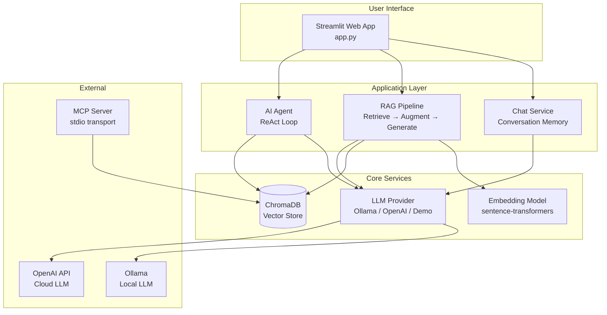

# Architecture

> **Note:** For the full architecture guide with layers, extension points, and security notes, see [ARCHITECTURE_GUIDE.md](ARCHITECTURE_GUIDE.md).

This document explains how the AI Learning Lab is structured and how data flows through the system.

## High-Level Architecture



## Component Details

### 1. Streamlit UI (`app.py`)

The entry point. Four tabs, each demonstrating a different AI concept:

| Tab | Module | Concept |
|-----|--------|---------|
| Chat | `src/chat/service.py` | Generative AI + conversation memory |
| RAG | `src/rag/pipeline.py` | Retrieval Augmented Generation |
| Agent | `src/agents/agent.py` | Agentic AI + tool calling |
| Concepts | Built-in | Learning reference |

### 2. LLM Provider (`src/llm/provider.py`)

Abstraction layer over different LLM backends:

```
Messages + Optional Tools
        │
        ▼
┌───────────────────┐
│   LLM Provider    │
│                   │
│  ┌─────────────┐  │
│  │   Ollama    │  │ ← Free, local (default)
│  ├─────────────┤  │
│  │   OpenAI    │  │ ← Cloud API
│  ├─────────────┤  │
│  │  Demo Mode  │  │ ← No LLM needed
│  └─────────────┘  │
└───────────────────┘
        │
        ▼
   LLMResponse
   (text + optional tool_calls)
```

### 3. RAG Pipeline (`src/rag/`)

```
┌──────────┐    ┌────────────┐    ┌───────────┐    ┌─────────┐
│ Document │───▶│  Chunking  │───▶│ Embedding │───▶│ ChromaDB│
│  (.txt)  │    │ (500 chars)│    │ (vectors) │    │ (store) │
└──────────┘    └────────────┘    └───────────┘    └─────────┘

                    QUERY TIME:
┌──────────┐    ┌────────────┐    ┌───────────┐    ┌─────────┐
│ Question │───▶│  Embedding │───▶│  Similarity│──▶│ Top-K   │
│          │    │  (query)   │    │  Search   │    │ Chunks  │
└──────────┘    └────────────┘    └───────────┘    └────┬────┘
                                                          │
                    ┌─────────────────────────────────────┘
                    ▼
            ┌──────────────┐    ┌─────────┐
            │ Prompt =     │───▶│   LLM   │───▶ Answer
            │ Context +    │    │ Generate│
            │ Question     │    └─────────┘
            └──────────────┘
```

### 4. AI Agent (`src/agents/`)

```
User Query
    │
    ▼
┌─────────────────────────────────────────┐
│              AGENT LOOP                  │
│                                         │
│  ┌─────────┐                           │
│  │   LLM   │─── tool_calls? ───┐       │
│  │  Think  │                   │       │
│  └─────────┘              No   │  Yes  │
│       ▲                        │   │   │
│       │                        ▼   ▼   │
│       │                   Return  ┌────────┐
│       │                   Answer  │ Execute│
│       │                           │  Tool  │
│       │                           └───┬────┘
│       │                               │
│       └──── Tool Result ──────────────┘
│                                         │
│  (max 5 steps)                          │
└─────────────────────────────────────────┘
    │
    ▼
Final Answer + Reasoning Steps
```

**Available Tools:**

| Tool | Input | Output |
|------|-------|--------|
| calculator | math expression | numeric result |
| get_weather | city name | weather info |
| get_current_time | none | current datetime |
| search_knowledge | search query | RAG answer |

### 5. MCP Server (`src/mcp/server.py`)

```
┌──────────────┐         stdio          ┌──────────────────┐
│ MCP Client   │◄────────────────────►│  MCP Server      │
│ (Cursor,     │   JSON-RPC messages   │  (ai-learning-   │
│  Claude,     │                       │   lab)           │
│  etc.)       │                       │                  │
└──────────────┘                       │  Tools:          │
                                       │  - calculator    │
                                       │  - get_weather   │
                                       │  - get_time      │
                                       │  - rag_search    │
                                       └──────────────────┘
```

## Data Flow Examples

### Chat Flow
```
User types "Hello" → ChatSession.send()
  → messages = [system, user:"Hello"]
  → LLM.chat(messages) → "Hi! How can I help?"
  → messages = [system, user:"Hello", assistant:"Hi!..."]
  → Display response
```

### RAG Flow
```
User asks "What is RAG?"
  → embed_query("What is RAG?") → [0.12, -0.45, ...]
  → vector_store.search() → top 3 chunks from 02_rag.txt
  → Build prompt: "Context: [chunks] \n Question: What is RAG?"
  → LLM.chat(prompt) → grounded answer
  → Display answer + source chunks
```

### Agent Flow
```
User asks "What's 15*23 and weather in Tokyo?"
  → Step 1: LLM → tool_call: calculator("15*23") → "345"
  → Step 2: LLM → tool_call: get_weather("Tokyo") → "28°C, Humid"
  → Step 3: LLM → "15×23 = 345. Tokyo is 28°C and humid."
  → Display answer + 3 reasoning steps
```

## File Dependency Graph

```
app.py
├── src/config.py
├── src/llm/provider.py
├── src/chat/service.py ──────► src/llm/provider.py
├── src/rag/pipeline.py ──────► src/rag/embeddings.py
│                            ► src/rag/vectorstore.py
│                            ► src/llm/provider.py
├── src/agents/agent.py ─────► src/agents/tools.py
│                            ► src/llm/provider.py
└── src/mcp/server.py ───────► src/agents/tools.py
                             ► src/rag/pipeline.py
```

## Technology Choices (and Why)

| Component | Choice | Why |
|-----------|--------|-----|
| Language | Python | Most popular for AI/ML, huge ecosystem |
| UI | Streamlit | Simplest way to build interactive AI apps |
| LLM | Ollama + OpenAI | Free local option + cloud fallback |
| Embeddings | sentence-transformers | Runs locally, no API key needed |
| Vector DB | ChromaDB | Embedded, no server setup, persists to disk |
| MCP | mcp Python SDK | Official SDK, stdio transport |
| Config | pydantic-settings | Type-safe config from .env files |
