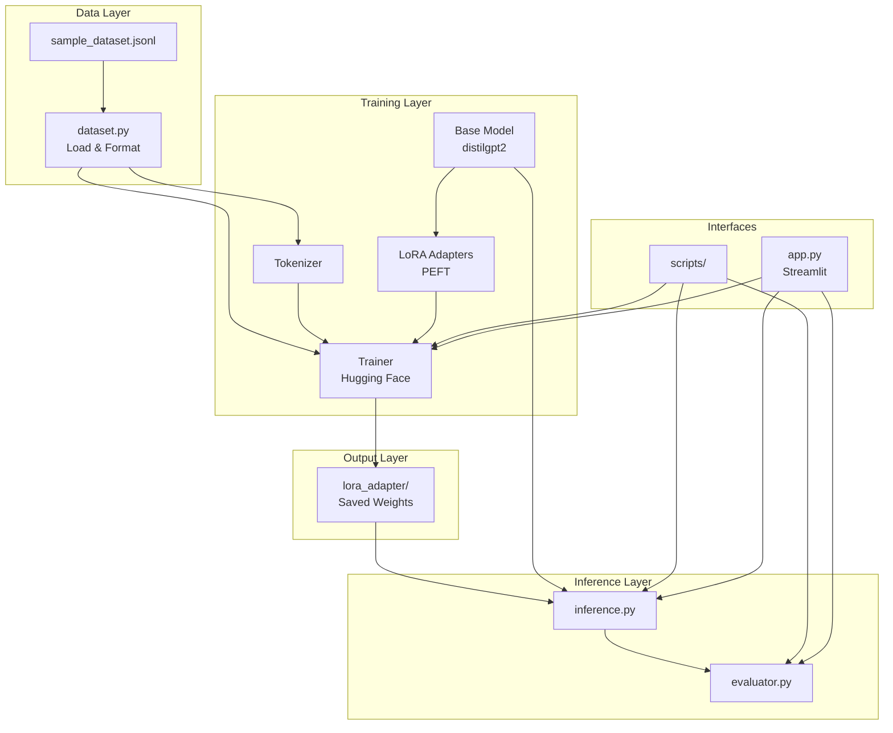

# Fine-Tuning Architecture Guide

System design for the **LLM Fine-Tuning Lab** module.

---

## Table of Contents

1. [Design Goals](#1-design-goals)
2. [System Overview](#2-system-overview)
3. [Architecture Layers](#3-architecture-layers)
4. [Component Reference](#4-component-reference)
5. [LoRA Explained](#5-lora-explained)
6. [Data Pipeline](#6-data-pipeline)
7. [Training Pipeline](#7-training-pipeline)
8. [Inference Architecture](#8-inference-architecture)
9. [File Structure](#9-file-structure)
10. [Extension Points](#10-extension-points)

---

## 1. Design Goals

| Goal | Implementation |
|------|----------------|
| Beginner-friendly | Small model (distilgpt2), CPU-compatible |
| Educational | Clear separation: data → train → infer → evaluate |
| Isolated module | Separate folder, own requirements, own docs |
| Production path | Same code scales to larger models + GPU |
| Minimal magic | Hugging Face Trainer + PEFT, industry standard |

---

## 2. System Overview



---

## 3. Architecture Layers

### Layer 1: Data

**Files:** `data/sample_dataset.jsonl`, `src/dataset.py`

- Loads JSONL instruction examples
- Formats as Alpaca-style prompts
- Splits into train (80%) and eval (20%)

### Layer 2: Training

**Files:** `src/trainer.py`, `src/config.py`

- Loads base causal LM from Hugging Face
- Applies LoRA via PEFT library
- Tokenizes and trains with Hugging Face `Trainer`
- Saves adapter weights (not full model)

### Layer 3: Inference

**Files:** `src/inference.py`

- Loads base model + optional LoRA adapter
- Formats instruction prompt
- Generates continuation tokens

### Layer 4: Evaluation

**Files:** `src/evaluator.py`

- Runs same prompts through base and fine-tuned models
- Returns side-by-side comparison

### Layer 5: Interfaces

**Files:** `scripts/*.py`, `app.py`

- CLI and Streamlit entry points
- No business logic — delegates to `src/`

---

## 4. Component Reference

### 4.1 Dataset Module (`src/dataset.py`)

```
TrainingExample
  ├── instruction: str
  ├── input: str
  └── output: str
        │
        ▼
  to_prompt() → Alpaca formatted text
  to_inference_prompt() → text without answer

load_jsonl(path) → list[TrainingExample]
build_dataset(path) → {train: Dataset, eval: Dataset}
```

### 4.2 Trainer Module (`src/trainer.py`)

```
train()
  │
  ├── Load tokenizer + base model
  ├── Apply LoraConfig → get_peft_model()
  ├── Tokenize train/eval datasets
  ├── Configure TrainingArguments
  ├── Trainer.train() + Trainer.evaluate()
  └── Save adapter to outputs/lora_adapter/
        │
        ▼
  TrainResult(train_loss, eval_loss, adapter_path, ...)
```

### 4.3 Inference Module (`src/inference.py`)

```
generate(instruction, input, adapter_path)
  │
  ├── Build inference prompt (no answer)
  ├── Load base model
  ├── If adapter exists → PeftModel.from_pretrained()
  ├── model.generate(max_new_tokens, temperature, top_p)
  └── Return GenerationResult
```

### 4.4 Evaluator Module (`src/evaluator.py`)

```
evaluate(limit)
  │
  ├── Load N examples from dataset
  ├── For each: greedy generate() without adapter
  ├── For each: greedy generate() with adapter
  └── Return EvalReport with comparisons
```

---

## 5. LoRA Explained

### Full Fine-Tuning vs LoRA

```
FULL FINE-TUNING:
  Base Model [████████████] ← ALL weights updated
  Cost: High GPU memory, slow, risk of catastrophic forgetting

LoRA (this module):
  Base Model [████████████] ← FROZEN (not changed)
  LoRA Adapter [██]           ← Small matrices trained
  Cost: Low memory, fast, adapters are portable
```

### How LoRA Works

Original weight update: `W' = W + ΔW` (ΔW is huge)

LoRA approximates: `ΔW ≈ A × B` where A and B are small matrices

- **r (rank)** = size of A and B (default: 8)
- Only A and B are trained → ~0.1–1% of parameters
- At inference: `output = W·x + (A·B)·x`

### LoRA Config in This Project

```python
LoraConfig(
    task_type=CAUSAL_LM,
    r=8,                    # rank
    lora_alpha=16,          # scaling factor
    lora_dropout=0.05,
    target_modules=["c_attn"],  # GPT-2 attention layers
)
```

---

## 6. Data Pipeline

```
sample_dataset.jsonl
        │
        ▼
  load_jsonl()
        │
        ▼
  TrainingExample objects
        │
        ▼
  to_prompt() → "### Instruction:\n...\n### Response:\n..."
        │
        ▼
  HuggingFace Dataset
        │
        ▼
  train_test_split(80/20)
        │
        ▼
  tokenizer(text, max_length=256, padding="max_length")
        │
        ▼
  Ready for Trainer
```

---

## 7. Training Pipeline

```
┌─────────────┐
│  Config     │  (.env → settings)
└──────┬──────┘
       ▼
┌─────────────┐
│ Load Model  │  AutoModelForCausalLM.from_pretrained("distilgpt2")
└──────┬──────┘
       ▼
┌─────────────┐
│ Apply LoRA  │  get_peft_model(model, lora_config)
└──────┬──────┘
       ▼
┌─────────────┐
│  Tokenize   │  Map dataset through tokenizer
└──────┬──────┘
       ▼
┌─────────────┐
│   Trainer   │  Forward → Loss → Backward → Update LoRA weights
│   Loop      │  (repeat for num_epochs)
└──────┬──────┘
       ▼
┌─────────────┐
│   Evaluate  │  eval_loss on held-out 20%
└──────┬──────┘
       ▼
┌─────────────┐
│    Save     │  outputs/lora_adapter/ (adapter only)
└─────────────┘
```

### Loss Function

**Causal Language Modeling (CLM):** Predict the next token given previous tokens.

- Input: tokenized training text
- Labels: same as input (shifted by 1 internally)
- Loss: cross-entropy on predicted vs actual next token

---

## 8. Inference Architecture

```
User Instruction
      │
      ▼
to_inference_prompt()
"### Instruction:\n...\n### Response:\n"
      │
      ▼
Tokenizer → input_ids
      │
      ▼
┌──────────────────────────────┐
│  Base Model + LoRA Adapter   │
│                              │
│  Autoregressive generation:  │
│  token₁ → token₂ → ... → EOS │
└──────────────────────────────┘
      │
      ▼
Decode tokens → strip prompt prefix → response text
```

### Adapter Loading

```python
base = AutoModelForCausalLM.from_pretrained("distilgpt2")
model = PeftModel.from_pretrained(base, "outputs/lora_adapter")
# LoRA weights merged at runtime — base weights unchanged on disk
```

---

## 9. File Structure

```
fine_tuning/
├── __init__.py
├── app.py                     # Streamlit UI
├── requirements.txt
├── .env.example
├── README.md
│
├── src/
│   ├── config.py              # pydantic-settings
│   ├── dataset.py             # JSONL → HF Dataset
│   ├── trainer.py             # LoRA training
│   ├── inference.py           # Generation
│   └── evaluator.py           # Base vs fine-tuned
│
├── data/
│   └── sample_dataset.jsonl
│
├── scripts/
│   ├── train.py
│   ├── evaluate.py
│   └── infer.py
│
├── outputs/                   # Created at runtime
│   └── lora_adapter/
│       ├── adapter_config.json
│       ├── adapter_model.safetensors
│       └── tokenizer files
│
└── docs/
    ├── USER_GUIDE.md
    ├── ARCHITECTURE.md        # This file
    └── CALL_FLOW.md
```

---

## 10. Extension Points

### Swap Base Model

```env
BASE_MODEL=microsoft/phi-2
```

Update `target_modules` in `trainer.py` for non-GPT architectures.

### Add Custom Metrics

Extend `trainer.py` with `compute_metrics` callback in Hugging Face Trainer.

### Merge Adapter into Full Model

```python
from peft import PeftModel
model = PeftModel.from_pretrained(base, adapter_path)
merged = model.merge_and_unload()
merged.save_pretrained("merged_model")
```

### Connect to Main AI Learning Lab

After merging, serve via Ollama or point `src/llm/provider.py` to a local Hugging Face pipeline.

---

## Technology Stack

| Component | Library | Purpose |
|-----------|---------|---------|
| Base framework | PyTorch | Tensor computation |
| Model & training | Hugging Face Transformers | Model loading, Trainer |
| Efficient fine-tuning | PEFT | LoRA adapters |
| Data | Hugging Face Datasets | Dataset handling |
| Config | pydantic-settings | .env loading |
| UI | Streamlit | Web interface |

---

## Related Documentation

- [User Guide](USER_GUIDE.md)
- [Call Flow Guide](CALL_FLOW.md)
