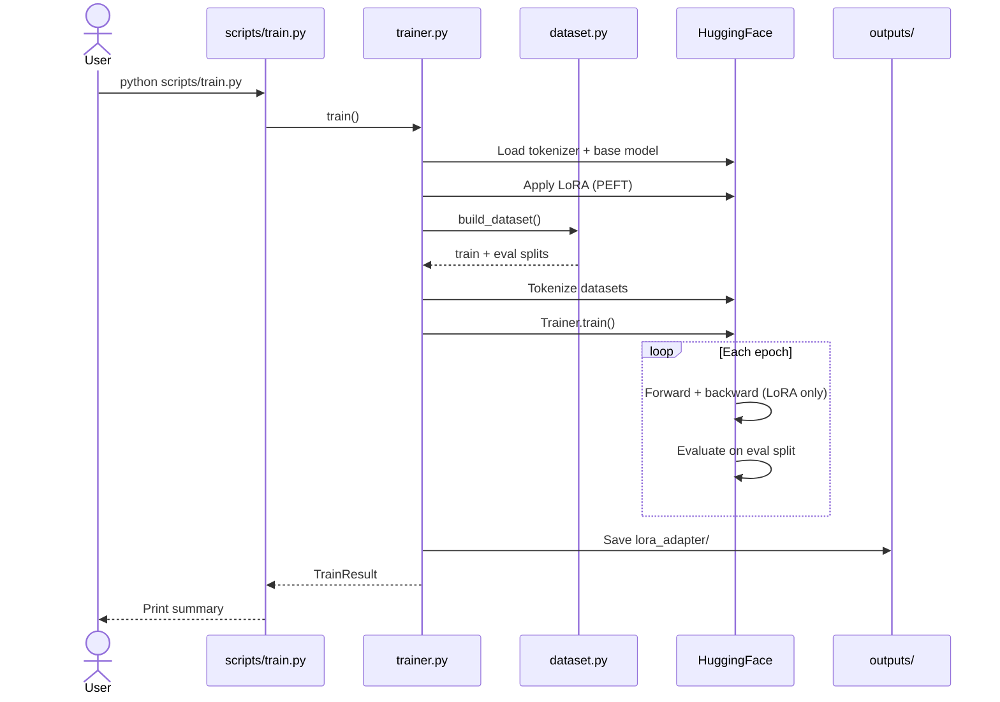
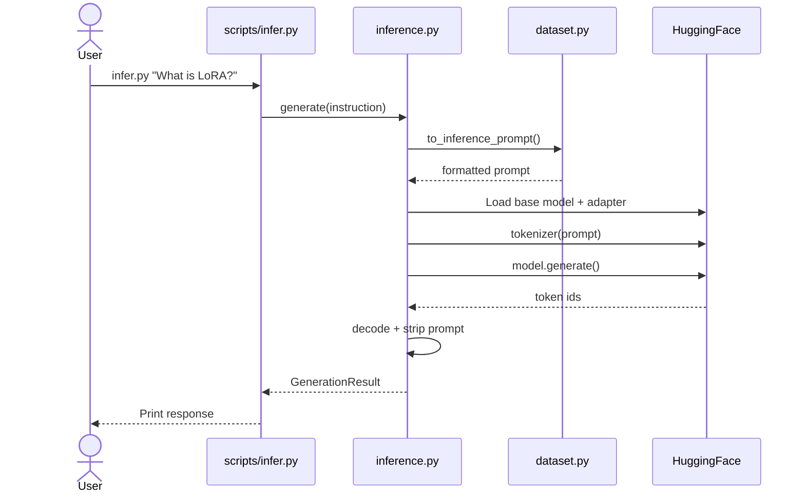
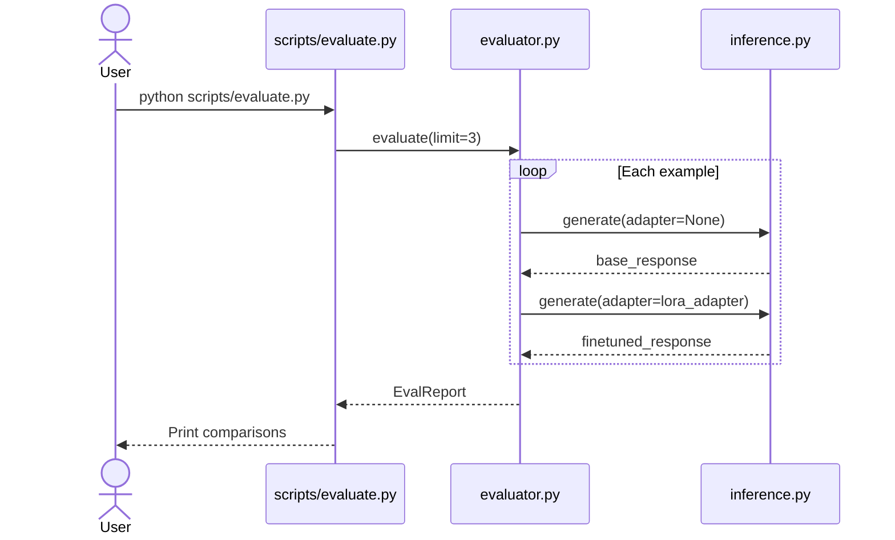

# Fine-Tuning Call Flow Guide

Step-by-step flows for every operation in the **LLM Fine-Tuning Lab**.

---

## Table of Contents

1. [Overview](#1-overview)
2. [Training Call Flow](#2-training-call-flow)
3. [Inference Call Flow](#3-inference-call-flow)
4. [Evaluation Call Flow](#4-evaluation-call-flow)
5. [Dataset Loading Flow](#5-dataset-loading-flow)
6. [Sequence Diagrams](#6-sequence-diagrams)
7. [Error Flows](#7-error-flows)

---

## 1. Overview

```
CLI / UI  →  scripts/  →  src/  →  Hugging Face / PyTorch  →  outputs/
```

All flows start from either:
- **CLI:** `python fine_tuning/scripts/<script>.py`
- **UI:** `streamlit run fine_tuning/app.py`

---

## 2. Training Call Flow

### Trigger
```bash
python fine_tuning/scripts/train.py
```

### Step-by-Step

```
STEP 1: Script entry
  File: fine_tuning/scripts/train.py
  Action: Import train() from src/trainer.py

STEP 2: Load configuration
  File: fine_tuning/src/config.py
  Action: Read fine_tuning/.env → FineTuneSettings singleton

STEP 3: Prepare output directory
  File: fine_tuning/src/trainer.py
  Action: Create fine_tuning/outputs/lora_adapter/

STEP 4: Resolve device
  Action: auto → cuda if available, else cpu

STEP 5: Load tokenizer
  Action: AutoTokenizer.from_pretrained("distilgpt2")
  Action: Set pad_token = eos_token if missing

STEP 6: Load base model
  Action: AutoModelForCausalLM.from_pretrained("distilgpt2")

STEP 7: Configure LoRA
  Action: LoraConfig(r=8, alpha=16, target_modules=["c_attn"])
  Action: model = get_peft_model(model, lora_config)
  Action: Print trainable parameters (~0.1% of total)

STEP 8: Load and split dataset
  File: fine_tuning/src/dataset.py
  Action:
    a. load_jsonl() → 15 TrainingExample objects
    b. Format each as Alpaca prompt text
    c. train_test_split(80/20)

STEP 9: Tokenize
  Action: Map each split through tokenizer
  Action: truncation=True, max_length=256, padding="max_length"

STEP 10: Configure Trainer
  Action: TrainingArguments(epochs, batch_size, lr, eval_strategy="epoch")
  Action: DataCollatorForLanguageModeling(mlm=False)

STEP 11: Training loop
  Action: trainer.train()
  For each epoch:
    a. Forward pass on train batch
    b. Compute cross-entropy loss
    c. Backward pass (update LoRA weights only)
    d. Evaluate on eval split
    e. Save checkpoint if best eval_loss

STEP 12: Save adapter
  Action: model.save_pretrained(outputs/lora_adapter/)
  Action: tokenizer.save_pretrained(outputs/lora_adapter/)

STEP 13: Return results
  Action: TrainResult(train_loss, eval_loss, total_steps, adapter_path)
  Action: Print summary to console
```

### Files Involved

| Step | File |
|------|------|
| Entry | `scripts/train.py` |
| Config | `src/config.py` |
| Training | `src/trainer.py` |
| Data | `src/dataset.py` |
| Storage | `outputs/lora_adapter/` |

---

## 3. Inference Call Flow

### Trigger
```bash
python fine_tuning/scripts/infer.py "What is LoRA?"
```

### Step-by-Step

```
STEP 1: Parse instruction from CLI args
  File: scripts/infer.py

STEP 2: Build inference prompt
  File: src/dataset.py → TrainingExample.to_inference_prompt()
  Result:
    "### Instruction:\nWhat is LoRA?\n\n### Response:\n"

STEP 3: Check for adapter
  Path: fine_tuning/outputs/lora_adapter/
  If exists → load with PeftModel
  If not → use base model only

STEP 4: Load model
  File: src/inference.py → _load_model()
  Action:
    a. AutoTokenizer.from_pretrained(base_model)
    b. AutoModelForCausalLM.from_pretrained(base_model)
    c. PeftModel.from_pretrained(base, adapter) if adapter exists
    d. model.eval(), move to device

STEP 5: Tokenize prompt
  Action: tokenizer(prompt) → input_ids tensor on device

STEP 6: Generate
  Action: model.generate(
    max_new_tokens=100,
    temperature=0.7,
    top_p=0.9,
    do_sample=True
  )

STEP 7: Decode and extract response
  Action: Slice output token IDs after the input-token length
  Action: Decode only generated tokens → return generated text

STEP 8: Print result
  Action: Display model name, adapter status, response
```

### Generation Loop (Internal)

```
Prompt tokens: [###, Instruction, :, What, is, LoRA, ?, ..., Response, :]
        │
        ▼
  model predicts next token → "Lo"
        │
        ▼
  append "Lo" → predict "RA" → append "RA" → ...
        │
        ▼
  until max_new_tokens or EOS token
```

---

## 4. Evaluation Call Flow

### Trigger
```bash
python fine_tuning/scripts/evaluate.py
```

### Step-by-Step

```
STEP 1: Load dataset examples
  File: src/evaluator.py
  Action: load_jsonl() → first N examples (default 3)

STEP 2: For each example:
  │
  ├── 2a. Generate with BASE model
  │     Action: generate(..., use_adapter=False, do_sample=False)
  │     Result: base_response
  │
  └── 2b. Generate with FINE-TUNED model
        Action: generate(..., adapter_path=outputs/lora_adapter, do_sample=False)
        Result: finetuned_response

STEP 3: Build comparison
  Action: EvalExample(instruction, expected, base_response, finetuned_response)

STEP 4: Return report
  Action: EvalReport(examples, adapter_path, base_model)

STEP 5: Display
  Action: Print side-by-side for each example
```

Evaluation uses greedy decoding so repeated comparisons are stable. It is a
qualitative inspection and does not calculate an accuracy or quality score.

---

## 5. Dataset Loading Flow

### Trigger
Any training or evaluation that needs data.

```
sample_dataset.jsonl
        │
        ▼
  open file, read line by line
        │
        ▼
  json.loads(line) → {instruction, input, output}
        │
        ▼
  TrainingExample(instruction, input, output)
        │
        ├── to_prompt()        → for TRAINING (includes answer)
        └── to_inference_prompt() → for INFERENCE (no answer)
```

### Train/Eval Split

```
15 examples total
        │
        ▼
  train_test_split(test_size=0.2, seed=42)
        │
        ├── train: 12 examples
        └── eval:  3 examples
```

---

## 6. Sequence Diagrams

### Training Sequence



### Inference Sequence



### Evaluation Sequence



---

## 7. Error Flows

### Missing Dataset

```
load_jsonl(path)
    │
    ▼
FileNotFoundError or empty file
    │
    ▼
ValueError: "No training examples found"
```

### Out of Memory

```
Trainer.train()
    │
    ▼
CUDA OOM / system memory exhausted
    │
    ▼
Fix: BATCH_SIZE=1, MAX_SEQ_LENGTH=128, DEVICE=cpu
```

### Adapter Not Found (Inference)

```
generate() with adapter_path
    │
    ▼
Path does not exist
    │
    ▼
Fallback: use base model only (used_adapter=False)
```

### Model Download Failure

```
from_pretrained("distilgpt2")
    │
    ▼
Network error / HF Hub down
    │
    ▼
Fix: check internet, set HF_TOKEN, or download model manually
```

---

## Quick Reference

| Action | Command | Core File | Output |
|--------|---------|-----------|--------|
| Train | `scripts/train.py` | `trainer.py` | `outputs/lora_adapter/` |
| Infer | `scripts/infer.py "..."` | `inference.py` | Text response |
| Evaluate | `scripts/evaluate.py` | `evaluator.py` | Comparison report |
| UI | `streamlit run fine_tuning/app.py` | `app.py` | Web interface |

---

## Related Documentation

- [User Guide](USER_GUIDE.md)
- [Architecture Guide](ARCHITECTURE.md)
