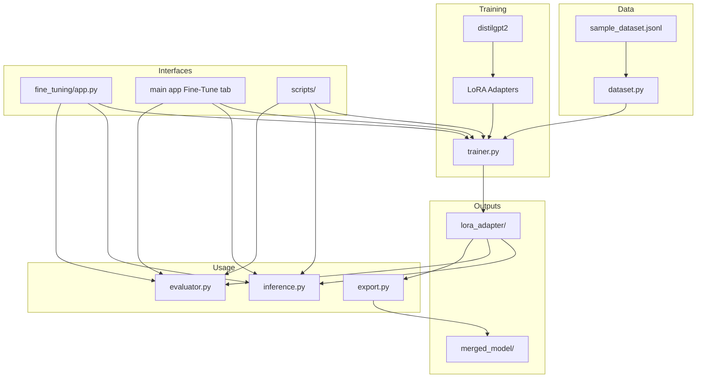

# Fine-Tuning Integration Diagram

How the Fine-Tuning module fits in the AI Learning Lab repository.

---

## Repository Position

```
AI_APP/
├── app.py                 ← Main lab + Fine-Tune tab
├── fine_tuning/
│   ├── app.py             ← Standalone fine-tuning UI
│   ├── src/               ← Training pipeline
│   ├── scripts/           ← CLI tools
│   └── outputs/           ← Trained adapters
├── medical_assistant/     ← Domain app (sibling)
└── src/                   ← Shared LLM for chat/RAG/agent
```

---

## Fine-Tuning Pipeline

```
sample_dataset.jsonl
        │
        ▼
  dataset.py (Alpaca format)
        │
        ▼
  trainer.py
    ├── Load distilgpt2
    ├── Apply LoRA adapters (PEFT)
    ├── Tokenize & train
    └── Save → outputs/lora_adapter/
        │
        ├──────────────┬──────────────┐
        ▼              ▼              ▼
   inference.py   evaluator.py   export.py
   (generate)     (compare)      (merge weights)
```

---

## Mermaid Diagram



---

## How It Relates to Chat / RAG / Agent

| Technique | What it changes | When to use |
|-----------|----------------|-------------|
| **Prompting** | Input text | Quick, no training |
| **RAG** | External knowledge at query time | Private/current docs |
| **Fine-tuning** | Model weights | Consistent style, specialized task |
| **LoRA** | Small adapter weights | Cheap fine-tuning |

Fine-tuning does NOT replace RAG — they complement each other in production systems.

---

## Student Learning Path

1. Master main app (Chat, RAG, Agent)
2. Run fine-tuning train → infer → evaluate
3. Compare: same question to base LLM vs fine-tuned adapter
4. Understand when fine-tuning beats prompting/RAG
