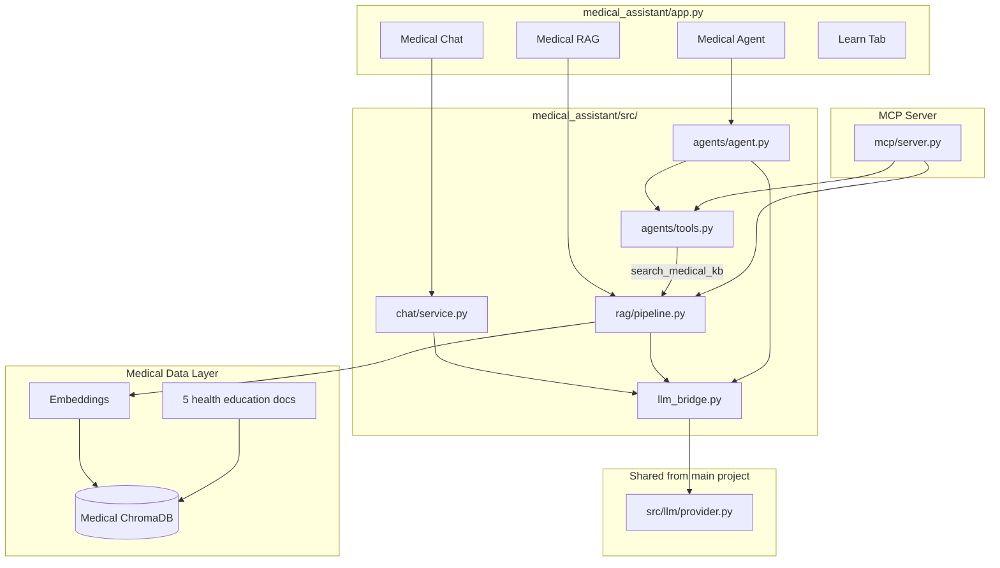

# Medical Assistant — Architecture Guide

System design for the healthcare domain application.

---

## 1. Design Goals

| Goal | Implementation |
|------|----------------|
| Same patterns as main lab | Chat, RAG, Agent, MCP |
| Healthcare domain | Medical prompts, tools, documents |
| Student learning | See how AI applies to a real industry |
| Safety first | Disclaimers everywhere, no real diagnosis |
| Reuse core LLM | Shared `src/llm/provider.py` from main project |

---

## 2. System Overview



---

## 3. Layer Architecture

### Presentation — `app.py`
Four tabs: Medical Chat, Medical RAG, Medical Agent, Learn

### Application
| Module | Responsibility |
|--------|----------------|
| `chat/service.py` | Medical tutor persona, safety rules in system prompt |
| `rag/pipeline.py` | Ingest & search health education documents |
| `agents/agent.py` | ReAct loop with medical tools |
| `agents/tools.py` | BMI, symptoms, drugs, specialists, KB search |

### Infrastructure
| Module | Responsibility |
|--------|----------------|
| `llm_bridge.py` | Import shared LLM from main `src/llm/` |
| `config.py` | Medical-specific paths and settings |

### Data
- Separate ChromaDB: `medical_assistant/data/chroma_db/`
- Collection: `medical_docs`
- 5 sample `.txt` files in `data/sample_docs/`

### Integration
- `mcp/server.py` — exposes medical tools via MCP stdio

---

## 4. Medical Agent Tools

```
User: "What's my BMI if I weigh 70kg and am 1.75m tall?"
  → Agent → bmi_calculator(70, 1.75) → "BMI: 22.9 (normal weight)"
  → Agent synthesizes educational answer with disclaimer
```

| Tool | Input | Output |
|------|-------|--------|
| bmi_calculator | weight_kg, height_m | BMI + category |
| symptom_lookup | symptom name | Educational info (mock DB) |
| medication_info | drug name | Educational info (mock DB) |
| find_specialist | specialty, city | Mock clinic list |
| search_medical_kb | query | RAG answer from health docs |

---

## 5. Safety Architecture

```
Every layer includes safety:

Chat system prompt  → "NOT medical advice, consult a doctor"
RAG prompt          → "Educational only" + disclaimer in answer
Agent prompt        → "Never diagnose or prescribe"
Agent final answer  → Appends disclaimer
App UI              → Warning banner at top
All docs            → DISCLAIMER headers
```

Production healthcare AI would add:
- HIPAA compliance, audit logs, clinician review, FDA/regulatory approval

---

## 6. Comparison with Main AI Learning Lab

| Component | Main Lab | Medical Assistant |
|-----------|----------|-------------------|
| Chat persona | AI tutor | Medical education tutor |
| RAG docs | AI concepts | Health education |
| Agent tools | calculator, weather | BMI, symptoms, drugs |
| Vector DB path | `data/chroma_db/` | `medical_assistant/data/chroma_db/` |
| MCP name | ai-learning-lab | medical-assistant-lab |
| LLM | `src/llm/provider.py` | **Shared** via llm_bridge |

---

## 7. File Structure

```
medical_assistant/
├── app.py
├── README.md
├── data/
│   ├── sample_docs/     # 5 health education files
│   └── chroma_db/       # vector store (runtime)
├── scripts/ingest.py
├── src/
│   ├── config.py
│   ├── llm_bridge.py   # → main src/llm/
│   ├── chat/service.py
│   ├── rag/pipeline.py
│   ├── agents/agent.py, tools.py
│   └── mcp/server.py
└── docs/
    ├── RUN_AND_USE.md
    ├── ARCHITECTURE.md
    ├── INTEGRATION_DIAGRAM.md
    ├── CALL_FLOW.md
    └── USER_GUIDE.md
```

---

## Related Docs

- [Integration Diagram](INTEGRATION_DIAGRAM.md)
- [Call Flow](CALL_FLOW.md)
- [Main Architecture](../../docs/ARCHITECTURE_GUIDE.md)
