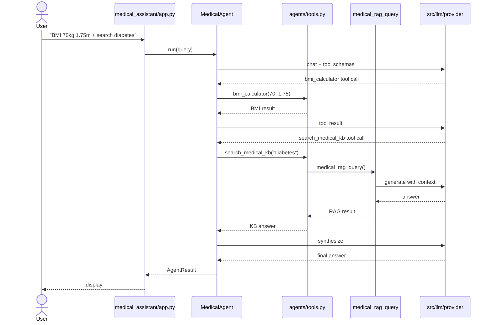

# Medical Assistant — Call Flow Guide

Step-by-step flows for every operation.

---

## Chat Flow

```
User types "What is hypertension?"
  → MedicalChatSession.send()
  → messages + medical system prompt (safety rules)
  → llm_bridge → src/llm/provider.py
  → response with educational disclaimer
  → display in UI
```

## RAG Ingest Flow

```
Click "Ingest Medical Docs"
  → ingest_directory(medical_assistant/data/sample_docs/)
  → For each .txt: chunk → embed → Medical ChromaDB
  → 5 files indexed (separate from main app ChromaDB)
```

## RAG Query Flow

```
User asks "What is CPR?"
  → medical_rag_query()
  → embed query → search Medical ChromaDB
  → retrieve chunks from 03_first_aid_basics.txt
  → build prompt with medical context + safety rules
  → LLM generates answer + disclaimer
  → show answer + source chunks
```

## Agent Flow — BMI Example

```
User: "Calculate BMI for 70kg and 1.75m"
  → MedicalAgent.run()
  → LLM → tool_call: bmi_calculator(70, 1.75)
  → result: "BMI: 22.9 (normal weight)..."
  → LLM → final answer with disclaimer
```

## Agent Flow — RAG Tool

```
User: "Search medical KB for diabetes symptoms"
  → Agent → search_medical_kb("diabetes symptoms")
  → medical_rag_query()  ← SAME as RAG tab
  → returns grounded answer from 02_common_conditions.txt
  → Agent presents to user
```

## MCP Flow

```
Cursor → tools/call {name: "medical_search", query: "first aid burns"}
  → mcp/server.py → medical_rag_query()
  → JSON result returned to client
```

---

## Sequence Diagram



---

## File Map

| Action | Entry | Core Logic |
|--------|-------|------------|
| Chat | app.py Chat tab | `chat/service.py` |
| RAG ingest | app.py / scripts/ingest.py | `rag/pipeline.py` |
| RAG query | app.py RAG tab | `rag/pipeline.py` |
| Agent | app.py Agent tab | `agents/agent.py` |
| MCP | `python -m medical_assistant.src.mcp.server` | `mcp/server.py` |
