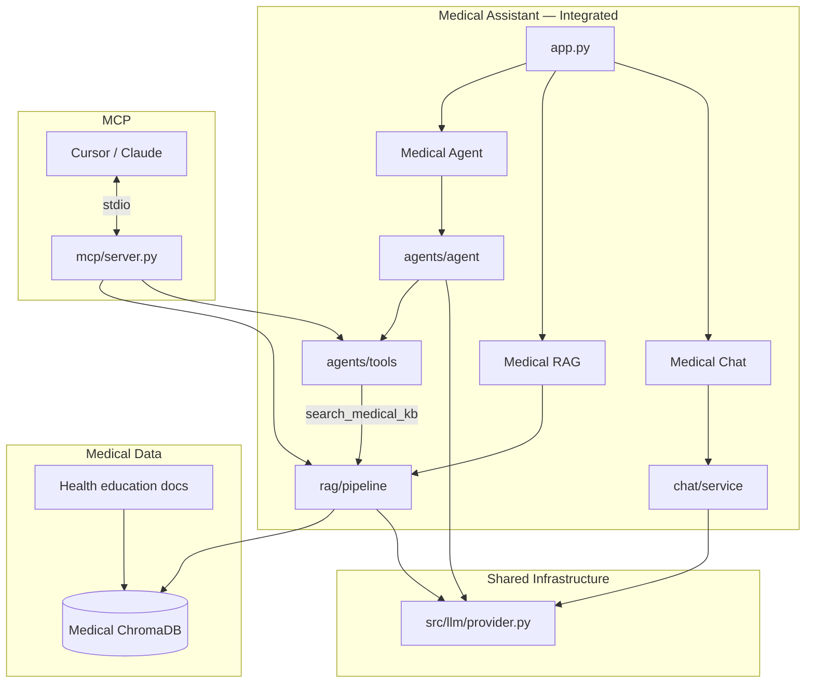

# Medical Assistant — Integration Diagram

How Chat, RAG, Agent, and MCP connect in the Medical Assistant application.

---

## Full Integration Map

```
┌─────────────────────────────────────────────────────────────────────────────┐
│                    MEDICAL ASSISTANT (Integrated Product)                    │
│                    medical_assistant/app.py                                  │
│                                                                              │
│  ┌──────────────┐  ┌──────────────┐  ┌──────────────┐  ┌──────────────┐   │
│  │ MEDICAL CHAT │  │ MEDICAL RAG  │  │ MEDICAL AGENT│  │    LEARN     │   │
│  └──────┬───────┘  └──────┬───────┘  └──────┬───────┘  └──────────────┘   │
│         │                 │                 │                              │
│         ▼                 ▼                 ▼                              │
│  chat/service.py   rag/pipeline.py    agents/agent.py                       │
│         │                 ▲                 │                              │
│         │                 │            agents/tools.py                      │
│         │                 │                 │                              │
│         │                 └── search_medical_kb ◄──┘                        │
│         │                 (Agent uses same RAG as RAG tab!)                   │
│         └─────────────────┬─────────────────┘                              │
│                           ▼                                                │
│                  ┌─────────────────┐                                       │
│                  │   llm_bridge    │ ──► src/llm/provider.py (SHARED)     │
│                  └────────┬────────┘                                       │
│                           │                                                │
│              ┌────────────┼────────────┐                                   │
│              ▼            ▼            ▼                                   │
│         Ollama       OpenAI        Demo Mode                                │
│                                                                              │
│  MEDICAL DATA (separate from main app):                                     │
│  ┌────────────┐    ┌─────────────┐    ┌─────────────────────┐              │
│  │ Embeddings │───►│ Medical     │◄───│ 5 health education │              │
│  │            │    │ ChromaDB    │    │ sample_docs/       │              │
│  └────────────┘    └─────────────┘    └─────────────────────┘              │
│                                                                              │
│  MCP SERVER (separate process):                                             │
│  ┌──────────────────────────────────────────────────────────────┐          │
│  │ medical_assistant/src/mcp/server.py                         │          │
│  │ Tools: calc_bmi, symptoms, medication, specialist, search   │          │
│  │                              └──────────► rag/pipeline.py     │          │
│  └──────────────────────────────────────────────────────────────┘          │
└─────────────────────────────────────────────────────────────────────────────┘

┌─────────────────────────────────────────────────────────────────────────────┐
│  MAIN AI LEARNING LAB (sibling app — same patterns, general domain)         │
│  fine_tuning/ (sibling — LoRA training module)                              │
└─────────────────────────────────────────────────────────────────────────────┘
```

---

## Mermaid Diagram



---

## Integration Points

| From | To | Connection |
|------|-----|------------|
| Medical Chat | LLM | Direct via `llm_bridge` |
| Medical RAG | LLM + ChromaDB | Retrieve health docs → generate answer |
| Medical Agent | LLM + Tools | ReAct loop |
| Agent | RAG | `search_medical_kb()` → `medical_rag_query()` |
| MCP | RAG + Tools | Same functions, external access |
| Main project LLM | Medical app | Shared `src/llm/provider.py` |

---

## Complete User Journey

```
1. INGEST (RAG tab)
   "Ingest Medical Docs" → 5 files → Medical ChromaDB

2. CHAT
   "What is hypertension?" → Medical tutor explains (general knowledge)

3. RAG
   "What is the CPR ratio?" → searches 03_first_aid_basics.txt → grounded answer

4. AGENT
   "BMI for 80kg 1.80m and search KB for diabetes symptoms"
   → Step 1: bmi_calculator → 24.7
   → Step 2: search_medical_kb → RAG from 02_common_conditions.txt
   → Step 3: combined educational answer

5. MCP (external)
   Cursor calls medical_search("first aid for burns")
   → same medical_rag_query() pipeline
```

---

## Three Apps in One Repository

| App | Folder | Domain | Integrated? |
|-----|--------|--------|-------------|
| AI Learning Lab | `/` (root) | General AI education | Yes |
| Medical Assistant | `medical_assistant/` | Healthcare education | Yes |
| Fine-Tuning Lab | `fine_tuning/` | LoRA training | Standalone |

All three teach the same AI patterns applied to different purposes.
